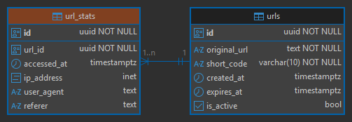

# 🚀 URL Link Shortener

> Высоконагруженный REST API сервис для сокращения URL с кэшированием.

[](LICENSE)

## 📖 О проекте

Этот проект представляет собой backend-сервис для сокращения URL ссылок. Проект является учебным.

**Основные цели проекта:**

- Обеспечить высокую производительность
- Продемонстрировать работу с кешем
- Реализовать полный CI/CD пайплайн

## ✨ Возможности

- ✅ **RESTful API** с полной валидацией данных
- ✅ **Кэширование** данных в Redis для ускорения отклика
- ✅ **Graceful shutdown** и обработка ошибок
- ✅ **Структурированное логирование** (Zap/Slog)
- ✅ **Swagger документация** API
- ✅ **Unit и Integration тесты** с покрытием >80%
- ✅ **Docker контейнеризация** и docker-compose

## 📸 Скриншоты

### Архитектура базы данных



## 🛠 Технологический стек

- **Фреймворк**: Gin
- **База данных**: 
- **Контейнеризация**: 
- **Логирование**: Zap

## 📦 Установка

### Требования

- Go 1.21+
- Docker & Docker Compose

1. **Клонируйте репозиторий:**

   ```bash
   git clone https://github.com/Dimidroll06/url-link-shortener .
   ```

2. **Настройте переменные окружения:**

   ```bash
   cp .env.example .env
   ```

3. **Запустите:**

   ```bash
   docker-compose up
   ```

## 📂 Структура папок

```
url-link-shortener/
│
├── cmd/
│   └── server/
│       └── main.go           # [ENTRY POINT]
│
├── cmd/                      # Документация и скриншоты
│
├── internal/
│   ├── core/                 # [DOMAIN LAYER]
│   │   ├── domain/           # Сущности
│   │   ├── ports/            # Интерфейсы
│   │   └── services/         # Реализация бизнес-правил
│   │
│   ├── adapters/             # [INFRASTRUCTURE LAYER]
│   │   ├── handlers/         # HTTP Handlers
│   │   ├── repository/       # Реализация доступа к PostgreSQL
│   │   ├── cache/            # Реализация доступа к Redis
│   │   └── server/           # Настройка HTTP сервера
│   │
│   ├── config/               # Чтение переменных окружения (.env)
│   └── logger/               # Настройка логгера
│
├── migrations/               # SQL миграции
├── docker-compose.yml
└── Dockerfile
```

## 📡 API Документация

После запуска приложения Swagger документация доступна по адресу:

🔗 **Swagger UI:** http://localhost:8080/swagger/index.html

### Основные endpoints

> To be continued

📥 **Insomnia коллекция:** [Скачать](./docs/insomnia_collection.json)

## 🧪 Тестирование

### Запуск тестов

```bash
go test ./...
```

### Покрытие кода

```bash
go test ./... -coverprofile=coverage.out
go tool cover -html=coverage.out -o coverage.html
```

Откройте `coverage.html` в браузере для просмотра детального отчета.

## 📄 Лицензия

Этот проект распространяется под лицензией MIT. Подробнее см. в файле [LICENSE](LICENSE).

<p align="center">Made with ❤️ using Go</p>
